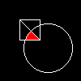

# graphics in PL/pgsql

## Introduction

This project was created as a solution for a assignment in the Algorithms subject on DELTA – High School of Computer
Science and Economics. The main goal of this assignment was to demonstrate our knowledge in the field of algorithms
in simple Computer Graphics. As a joke I decided to use PL/pgsql as the programming language for this project.

## Rendering

Currently, the project is able to render the canvas into a `.png` file, but it actually uses PL/python to do so. Which I
think might be a little bit of cheating. But the future plan could be to implement a simple `.png` file writer in
PL/pgsql. If that was in any simple way possible, otherwise I could also implement a simple SVG writer in PL/pgsql,
which would just render each pixel as a rectangle in the svg and that'd be it.

## Example usage

```sql
CALL clear_canvas(100, 100);

CALL draw_rect(25, 25, 50, 50);
CALL draw_line(25, 25, 50, 50);

CALL draw_circle(60, 60, 30);

CALL fill(48, 49, 255, 0, 0);

select *
from public.render_canvas_to_png();
```
outputs this beautiful image:



