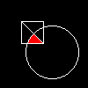

# graphics in PL/pgsql

## Introduction

This project was created as a solution for a assignment in the Algorithms subject on DELTA – High School of Computer
Science and Economics. The main goal of this assignment was to demonstrate our knowledge in the field of algorithms
in simple Computer Graphics. As a joke I decided to use PL/pgsql as the programming language for this project.

As an requirement I had to also write a frontend to it, because the teacher had changed the assignment to "user-friendly"
after I had already started. The main focus wasn't on the frontend, so beware that it is not the prettiest thing in the world. It is written in Java.

Functionality is documented in [docs.md](docs.md).

## Set up

To setup just run `docker compose up`, or `setup_db.sh` if you want to run it locally. Running it locally might have some performance benefits.

## Example usage

```sql
CALL clear_canvas(100, 100);

CALL draw_rect(25, 25, 50, 50);
CALL draw_line(25, 25, 50, 50);

CALL draw_circle(60, 60, 30);

CALL fill(48, 49, 255, 0, 0);

select *
from public.render_canvas_to_png(); -- or render_canvas_to_bmp!
```

outputs this beautiful image:



